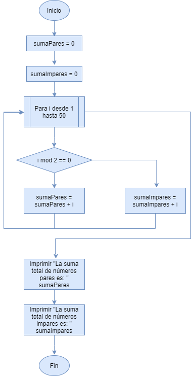
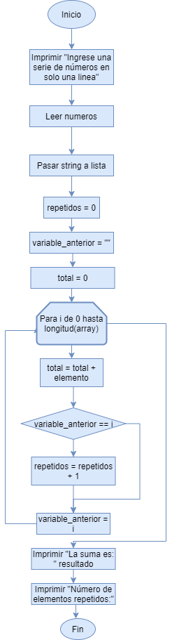

```{r setup, include=FALSE}
knitr::opts_chunk$set(echo = TRUE)
```

## Estructuras repetitivas
### Ejericio 2
Desarrollar un programa que calcule independientemente la suma de los números pares e impares comprendidos entre 1 y 50

```{r}
sumaPares = 0
sumaImpares = 0
for (i in 1:50){
    if (i%%2==0){
        sumaPares = sumaPares + i
    }else{
        sumaImpares = sumaImpares + i   
    }
}
print("La suma total de números pares es: ")
print(sumaPares)
print("La suma total de números impares es: ")
print(sumaImpares)
```


## Arrays
### Ejercicio 1
Dado una serie de números ingresados por el usuario, elaborar un programa que coloque estos números en un array de integers y que encuentre la suma de sus elementos. Además de determinar si existen elementos repetidos.



```{r}
print("Digite la cantidad de elementos que va a ingresar")
cantidad <- readline()
i = 1

numeros <- vector(mode = "numeric", length = cantidad)

while(i <= cantidad){
    print("Ingrese el digito numero: ")
    print(i)
    numeros[i] = as.numeric(readline())
    i = i +1
}

repetidos = 0
variable_anterior = ""
resultado = 0

for (i in seq_along(numeros)) {
    resultado = numeros[i] + resultado
    if (variable_anterior == numeros[i]){
        repetidos = repetidos + 1
    }
    variable_anterior = numeros[i]
}

print("La sumas es: ")
print(resultado)
print("El número de repetidos es: ")
print(repetidos)
```
```{r}
for (i in seq_along() {
    print(i)
}

```

