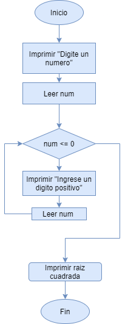

```{r setup, include=FALSE}
knitr::opts_chunk$set(echo = TRUE)
```

## Ejercicio 1
Escribe un programa que pida un número por teclado, si el número es negativo volver a pedirlo y así sucesivamente hasta que el usuario ingrese un número positivo. Por último con el número ingresado correctamente calcular su raíz cuadrada.

```{r}
print("Digite un número entero")
num <- readline()
num <- as.numeric(num)
while(num <= 0){
    print("Digite un número positivo")
    num <- readline()
    num <- as.numeric(num)
}
print(sqrt(num))
```

